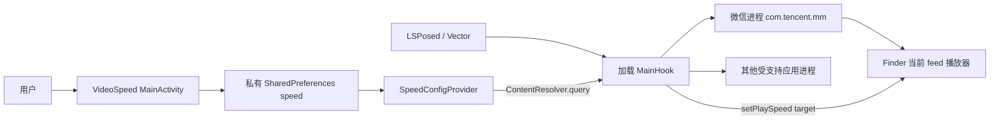

# VideoSpeed 技术全景与微信视频号适配指南

> 文档定位：这是项目的技术总览、教学材料和外部 AI 上下文入口。它解释“系统为什么能工作”，而不是只给出安装步骤。
>
> 当前基线：VideoSpeed `1.2.6`，适配目标为微信 `8.0.69`（`versionCode 3022 GP / 3040`），最后更新：`2026-06-25`。

## 1. 一页读懂

VideoSpeed 是一个 Android **Xposed 模块**。它同时包含两个角色：

1. 一个普通 Android 设置应用：让用户保存默认播放速度。
2. 一段由 LSPosed/Vector 注入目标应用进程的 Java Hook 代码：在播放器初始化、开始播放或切换视频时，把目标速度写入真实播放器。

微信视频号是当前最特殊的适配。微信每个新视频会重新回到 `1.0x`，旧版仅仅等待 `setPlaySpeed()` 被调用并修改参数，在微信 `8.0.69` 的 feed 流上并不可靠。当前实现改为：

```text
进入视频号 / 手指滑动结束
        ↓
FinderHome Activity 的 onResume / dispatchTouchEvent(ACTION_UP)
        ↓ 延迟 350/450/1200 ms，等待 RecyclerView 与播放器绑定完成
找到当前可见视频的 ViewHolder
        ↓
FinderVideoLayout.getVideoView()
        ↓
FinderThumbPlayerProxy.setPlaySpeed(用户配置)
```

这叫**主动注入**：不再等微信“恰好调用”速度 setter，而是在可确认的新视频生命周期点主动找到当前播放器并设速。

需要特别理解：播放器实际已经变速，不等于微信 UI 一定显示 `2x`。本模块修改的是播放器状态，不是微信速度菜单的显示状态。

## 2. 术语

| 术语 | 本项目中的含义 |
|---|---|
| Xposed | 在 Android Java/ART 方法调用前后插入逻辑的 Hook API 规范与生态 |
| LSPosed / Vector | 在 Root、Zygisk 等环境中提供 Xposed 运行时的框架实现 |
| Module | 被 LSPosed 加载的模块；VideoSpeed 的准确称呼，不是浏览器意义上的 Plugin |
| Hook | 拦截方法调用，读取或修改参数、返回值，或在调用前后执行代码 |
| 宿主/目标应用 | 被注入的应用，例如微信 `com.tencent.mm` |
| ClassLoader | Android 运行时加载 Java 类的对象；Hook 必须使用目标应用的 ClassLoader 找到目标类 |
| 混淆 | 将类名、方法名缩短或改写；微信中的 `me5.s0`、`q40` 都可能随版本变化 |
| XSharedPreferences | Xposed 提供的跨进程只读配置访问方式，让微信进程读取 VideoSpeed 的配置文件 |
| 主动注入 | 模块在播放事件后主动调用 setter，而不是只拦截宿主原本发起的 setter 调用 |
| Native Hook | 在 `.so`/C/C++ 层拦截函数；本次微信适配没有采用该路线 |

## 3. 总体架构



### 3.1 APK 中的三个入口

| 入口 | 文件 | 职责 |
|---|---|---|
| Android 应用入口 | `MainActivity.java` | 读取、展示和保存速度配置 |
| Xposed 声明 | `AndroidManifest.xml` | 声明这是 Xposed 模块、最低 API 和建议作用域 |
| Hook 入口 | `assets/xposed_init` | 指向 `io.github.MarsGao.speed.MainHook` |

`MainHook` 实现 `IXposedHookLoadPackage`。目标应用进程启动时，框架调用：

```java
handleLoadPackage(XC_LoadPackage.LoadPackageParam lpparam)
```

模块先按 `packageName` 和 `processName` 路由，只在受支持应用的主进程注册 Hook，避免把逻辑注入无关进程。

### 3.2 运行边界

设置页运行在 `io.github.MarsGao.speed` 进程；Hook 运行在微信、B 站、X 等目标应用自己的进程。两者：

- 不共享 Java 静态变量；
- 不共享 `Context`；
- 不能直接调用彼此对象；
- 通过磁盘上的 `speed.xml` 传递配置。

这是理解 `1.2.4` 修复的关键。

## 4. 技术栈

| 层 | 当前技术 |
|---|---|
| 语言 | Java 8 语法级别 |
| Android | `minSdk 26`、`targetSdk 33`、`compileSdk 33` |
| Hook API | `de.robv.android.xposed:api:82`，`compileOnly` |
| Hook 运行时 | LSPosed / Vector 等兼容实现 |
| 构建 | Gradle `8.0`、Android Gradle Plugin、JDK 17 |
| 配置 | Android `SharedPreferences` + 只读 `ContentProvider`（`XSharedPreferences` 兼容回退） |
| 反射 | Java Reflection + `XposedHelpers` |
| 发布 | GitHub Actions、LSPosed 格式 Tag：`VersionCode-VersionName` |

依赖使用 `compileOnly` 很重要：Xposed API 类由设备上的框架在运行时提供，不应被作为普通运行库重复打包。

版本号由 `gradle.properties` 的 `appVersionName` 计算：

```text
versionCode = major * 1,000,000 + minor * 1,000 + hotfix
1.2.4 => 1,002,004
```

## 5. 设置是怎样进入微信进程的

### 5.1 写入端

`MainActivity` 使用普通 `SharedPreferences`：

```text
文件：shared_prefs/speed.xml
键：speed
类型：float
```

用户点击“设置”后，代码使用同步 `commit()`。只有返回 `true` 才提示成功。这里不使用旧版的“先 remove/apply 再写入”技巧，因为异步 `apply()` 会引入不必要的竞态。

### 5.2 读取端

`MainHook` 在目标应用进程中优先查询：

```java
content://io.github.MarsGao.speed.config/speed
```

Provider 在 VideoSpeed 自身进程读取私有偏好，只向其他应用暴露一个只读浮点值。这样 Android 16/SELinux 下的目标进程无需穿越 VideoSpeed 私有目录。`XSharedPreferences` 与最小文件权限仍保留为兼容回退：

```text
/data/data/io.github.MarsGao.speed/               711：可穿越，不对外列目录
/data/data/io.github.MarsGao.speed/shared_prefs/  至少 755：可穿越、可读取
/data/data/io.github.MarsGao.speed/shared_prefs/speed.xml 至少 644：可读取
```

不要把应用数据根目录设成全员可读。根目录只需要执行位来允许路径穿越；过度放宽还可能破坏 Android `run-as` 的安全检查。

### 5.3 默认值

- 普通应用 Hook 的配置兜底：`1.5f`。
- 微信专用兜底：`2.0f`。
- 用户明确设置 `1.0x` 时，微信主动注入会跳过，等价于不强制变速。

微信专用兜底并不能替代配置可读性；它只能保证读取失败时仍满足“默认 2x”的核心目标。

## 6. 通用 Hook 模式

不同应用使用不同播放器，项目没有一个对所有应用都成立的万能 setter。当前代码综合使用四类模式：

1. **精确 Hook**：已知类名、方法名和签名时，直接 `findAndHookMethod`。
2. **生命周期补设**：在 `prepare/start/play/resume` 后主动设速，处理播放器重置。
3. **参数改写**：宿主传入 `1.0f` 时，在 `beforeHookedMethod` 中替换成目标速度。
4. **反射发现**：面对混淆或多版本实现，扫描候选类和 float setter。

主要适配概况：

| 应用族 | 主要播放器/策略 |
|---|---|
| Bilibili | IjkMediaPlayer，沿 prepared/start 链定位并设置速度 |
| Twitter/X/Piko | Media3/ExoPlayer 生命周期补设与自动重置拦截，保留 legacy fallback |
| 抖音 | SimPlayer、TTPlayer 的 prepare/resume/setSpeed/setPlaySpeed |
| 小红书 | IjkMediaPlayer / RedPlayerCore |
| 微博 | MagicCubePlayer / IjkMediaPlayer |
| Instagram/Instander | 通过运行时对象和消息链定位播放器 |
| Telegram | PhotoViewer/VideoPlayer 多签名兼容 |
| 微信视频号 | Finder 当前 feed 播放器主动注入，外加诊断型候选扫描 |

核心工程原则是：**速度不是一次设置后永久有效的属性**。宿主可能在新视频、seek、resume、播放器复用或数据源切换时重置到 `1.0x`，所以必须找到合适的重复注入时机。

## 7. 微信视频号：从误判到真实路径

### 7.1 已确认的播放器链

微信 `8.0.69` 视频号使用腾讯 ThumbPlayer 体系和微信自研媒体层。当前 Java 层可控对象是：

```text
com.tencent.mm.plugin.finder.ui.FinderHomeAffinityUI
  └─ R.id.m6e / RefreshLoadMoreLayout
      └─ getRecyclerView()
          └─ 当前可见 ViewHolder（8.0.69 中见 me5.s0）
              └─ holder.o(R.id.e_k)
                  └─ FinderVideoLayout.getVideoView()
                      └─ FinderThumbPlayerProxy
                          └─ setPlaySpeed(float)
```

这里的 `R.id.m6e`、`R.id.e_k`、`me5.s0` 和 `q40` 都属于版本相关实现细节，不应被当成永久 API。

### 7.2 为什么旧思路不稳定

旧逻辑主要被动 Hook `FinderThumbPlayerProxy.setPlaySpeed/play`。问题是：

- feed 流并不保证在每个新视频开始时调用被 Hook 的旧入口；
- “Hook 注册成功”只证明方法存在，不证明运行时经过它；
- 每个新视频仍可能由内部状态机重置为 `1.0x`；
- 仅根据类名猜 ExoPlayer、LiteAV 或系统 MediaPlayer，会产生大量无命中路径。

因此，稳定性问题不是“setter 无效”，而是“没有在真实的当前播放器实例与正确时机调用 setter”。

### 7.3 当前主动注入算法

#### 触发点

- `Activity.onResume` 后延迟 `350 ms` 和 `1200 ms`；
- `Activity.dispatchTouchEvent(ACTION_UP)` 后延迟 `450 ms`。

双延迟是为了覆盖 Activity 已恢复但 RecyclerView 尚未完成布局、ViewHolder 尚未绑定播放器的窗口。滑动后的 `ACTION_UP` 则是 feed 切换的稳定外部信号。

#### 定位当前视频

1. 仅接受类名位于 Finder 包且包含 `FinderHome` 的 Activity。
2. 通过资源 ID 找到 feed RecyclerView 容器。
3. 尝试混淆方法 `LayoutManager.w()` 或标准 `findFirstVisibleItemPosition()` 获取当前位置。
4. 尝试 `q0(position, false)` 或标准 `findViewHolderForAdapterPosition()` 获取 holder。
5. 最后遍历可见 child，寻找当前已知 holder `me5.s0`。
6. 从 holder 取得视频布局，再调用 `getVideoView()` 得到真实播放器代理。

#### 设置速度

`applyWeChatTargetSpeed()` 按顺序尝试常见 setter：

```text
setRate
setSpeed
setPlaySpeed          <- 当前 FinderThumbPlayerProxy 实际命中
setPlaybackSpeed
setPlaybackRate
setPlaySpeedRatio
setVideoSpeedRatio
tpSetPlaySpeed
setPlaybackParameters <- Media3/ExoPlayer 风格兜底
```

当前成功日志的核心形态：

```text
[VideoSpeed] FinderActivity.onResume current ...FinderThumbPlayerProxy setRate target via setPlaySpeed: 2.0
[VideoSpeed] FinderActivity.touchUp current ...FinderThumbPlayerProxy setRate target via setPlaySpeed: 1.5
```

日志里的 `setRate target via setPlaySpeed` 是历史日志措辞，真正调用的方法由 `via` 后面的名称表示。

### 7.4 重入保护与手动调速

模块主动调用 `setPlaySpeed()` 时，会再次触发已注册的 setter Hook。`ThreadLocal<Boolean> wxApplyingSpeed` 用来标记“这是模块自己发起的调用”，防止递归和误判。

手动调速保护有两层：

- setter 调用栈检测：只把明确的 `onClick`、`onTouchEvent`、`performClick` 或速度菜单类视为人工操作；
- Finder 菜单 `q40.onClick(View)`：读取 View tag 中的 Float，并开启 `3000 ms` 冷却期。

第二层依赖混淆类名，在微信 `3022 GP` 上可能注册失败。它是增强保护，不是主动注入主路径；是否兼容仍应以实际 `setPlaySpeed` 日志和播放行为判断。

### 7.5 为什么界面不显示 2x

微信速度菜单的文字、选中项和播放器内部速度可能由不同状态对象管理。本模块直接调用播放器 setter，没有同步修改菜单 ViewModel，因此可能出现：

```text
实际播放：2.0x
微信菜单：仍无 2x 标记或仍显示默认状态
```

这是当前设计的已知表现，不代表注入失败。若未来要同步 UI，需要额外定位微信速度菜单状态模型，维护成本和版本耦合都会明显增加。

## 8. 本次升级改变了什么

本轮不是一次单点修补，而是 `1.2.2 -> 1.2.3 -> 1.2.4` 的两阶段收敛。

### 8.1 1.2.2：诊断面扩大

- 增加 `ClassLoader.loadClass` 探针，观察 Finder/video/player/thumbplayer 候选类；
- 扫描单 float 参数的 speed/rate/playback setter；
- 在 start/play/resume/prepare 等播放点后尝试补设；
- 收紧“手动改速”的调用栈判断。

价值：证明 Java 层存在可控速度方法，并排除“热补丁导致静态分析完全失效”等误判。

局限：广谱发现能帮助找路，但不能保证拿到 feed 当前正在播放的那个实例。

### 8.2 1.2.3：从被动拦截改为主动定位

- 新增 Finder Activity resume/touch 注入器；
- 沿 RecyclerView -> 当前 holder -> video layout -> video view 找到真实实例；
- 对 `FinderThumbPlayerProxy` 主动调用 `setPlaySpeed(target)`；
- 增加手动菜单点击冷却；
- 设置保存改为单次同步 `commit()`；
- 增加微信专用 `2.0f` 兜底；
- 为跨进程读取补充目录可遍历权限。

这是“默认进入即 2x、滑到下一条仍回到默认速度”真正稳定下来的主要版本。

### 8.3 1.2.4：修正 XSharedPreferences 可见性

实机发现：配置文件内容已经是 `1.5` 或 `1.8`，但微信仍读到旧值/兜底值。原因是跨进程读取不仅要求 XML 可读，还要求路径上的每一级目录可穿越。

`1.2.4` 调整 `makePrefsReadable()`：

- 应用数据根目录保持仅 owner 可读，同时向其他进程开放执行/穿越权限；
- `shared_prefs` 目录开放读取与穿越；
- `speed.xml` 开放读取；
- 在 Activity 初始化和每次成功保存后都执行权限修正。

### 8.4 1.2.5：使用 Provider 作为主配置桥接

Ace 5 / Android 16 / Vector 实测表明，即使设置页已保存 `1.5`，微信进程仍可能无法读取私有 XML 并回退到微信旧默认 `2.0`。`1.2.5` 使用标准 Android `ContentProvider` 在进程边界传递只读配置，所有 Hook 目标统一优先使用该桥接；文件读取只保留为兼容回退。

### 8.5 1.2.6：处理晚加载模块的上下文获取

部分 Vector 目标进程会在 `Application.attach()` 之后才加载模块。配置桥接因此还会从 `ActivityThread.currentApplication()` 获取当前应用上下文，确保 Provider 查询不因错过 `attach()` 而退回旧文件读取。

因此，这次升级解决的是两个独立问题：

```text
播放稳定性：找到正确实例 + 正确注入时机
配置稳定性：让目标进程可靠读到用户刚保存的速度
```

## 9. 被否决或降级的路线

### 9.1 ExoPlayer 不是微信视频号主路径

项目仍保留部分 ExoPlayer 兜底代码，但微信视频号 `8.0.69` 的已验证主路径是 `FinderThumbPlayerProxy`。不能因为项目中存在 ExoPlayer 代码，就推断当前 feed 使用它。

### 9.2 LiteAV/系统 MediaPlayer 不是本轮成功依据

历史版本尝试过 `TXVodPlayer`、`TXLivePlayer`、`android.media.MediaPlayer` 等路径。它们可作为其他微信视频场景或未来诊断候选，但本轮 feed 流稳定生效的证据不是这些路径。

### 9.3 Native FFmpeg/ThumbPlayer Hook 不适合作为首选

- 微信媒体库的关键速度符号未导出，难以稳定定位；
- 默认 `1.0x` 时 FFmpeg `atempo` 滤镜图未必存在可拦截节点；
- 只改音频会造成音视频不同步；
- ABI、微信版本和反调试会显著扩大维护面。

只要 Java 层仍能取得当前播放器并调用公开/反射可见 setter，就应优先 Java Hook。

### 9.4 热补丁不是本次根因

微信 Tinker 补丁会改变运行时代码来源，但已对比的 `8.0.69` base 与当时 patch 中 Finder 相关代码一致。真正的问题是 feed 播放路径和注入时机，不是“看到 patch 就推定所有静态分析失效”。

## 10. 验证方法与证据等级

不要用单一现象判断成功。推荐证据等级：

1. **用户行为**：进入视频号明显变速，滑到下一条仍按默认速度播放。
2. **运行日志**：出现当前 `FinderThumbPlayerProxy` 和目标值的 `setPlaySpeed` 成功行。
3. **配置证据**：`speed.xml` 中的 float 与日志目标值一致。
4. **注册证据**：出现 `Activity resume/touch hooks installed`。

仅有第 4 级不够：Hook 注册成功不代表运行期命中。反过来，某些 Root/框架组合不方便拉取 LSPosed 日志时，清晰且可重复的播放行为仍是有效主证据。

### 10.1 当前验证矩阵

| 设备/微信 | 已取得的证据 | 结论 |
|---|---|---|
| Xiaomi 14 Pro / `8.0.69 (3040)` | `onResume`、`touchUp` 均命中真实 `FinderThumbPlayerProxy.setPlaySpeed`；`2.0` 与 `1.5` 日志及体感一致 | 主路径完整验证 |
| OnePlus 13 / `8.0.69 (3022 GP)` | 早期版本已由用户确认实际变速；`1.2.4` 已确认安装、配置保留和主 Hook 注册，`q40` 增强 Hook 有混淆漂移 | 主路径兼容，当前 `1.2.4` 的 feed 运行日志仍应在解锁进入视频号后复核 |

验证矩阵记录的是证据强度，不是永久兼容承诺。微信小版本、渠道包、热补丁和设备框架变化后都应重新取证。

### 10.2 快速复测

```powershell
$adb = 'F:\MarsDesktop\#Miui\#ADB\ADB\adb.exe'
$serial = '<device-serial>'

& $adb -s $serial shell dumpsys package io.github.MarsGao.speed |
  Select-String 'versionName=|versionCode=|lastUpdateTime='
& $adb -s $serial shell dumpsys package com.tencent.mm |
  Select-String 'versionName=|versionCode=|lastUpdateTime='
```

打开 VideoSpeed、保存速度、强停并重启微信，然后从微信 UI 进入 `发现 -> 视频号`。拉取日志：

```powershell
$out = & $adb -s $serial shell su -c `
  'cat /data/adb/lspd/log/modules_*.log /data/adb/lspd/log/verbose_*.log 2>/dev/null | tail -n 5000'
$out | Select-String -Pattern `
  '\[VideoSpeed\].*(FinderInject|setRate target|manual speed)' |
  Select-Object -Last 60
```

完整设备复测步骤以 `.agents/skills/bilispeed-wechat-finder/SKILL.md` 为准。

## 11. 微信升级后的高效适配顺序

微信版本变化时，按以下顺序排查，避免重新从 native 层开始猜：

1. 记录设备序列号、系统、Root/LSPosed、微信 versionName/versionCode 和安装来源。
2. 确认模块已启用，作用域包含 `com.tencent.mm`，并真正重启微信主进程。
3. 确认是否进入 `FinderHomeAffinityUI`，播放器 UI 是否实际加载。
4. 查找 `FinderInject` 注册日志和 `setPlaySpeed` 运行日志。
5. 若有注册但无注入，依次检查 Activity 名、RecyclerView ID、当前位置方法、holder、video layout ID、`getVideoView()`。
6. 若能取得播放器但 setter 失败，只对 Finder/video/player/thumbplayer 候选类开启受限 Java 探针。
7. 更新已漂移的最小节点，关闭生产版本中的高噪声探针。
8. 只有 Java 路径被实证为不存在时，才重新评估 native 路线或标记该版本暂不支持。

### 11.1 漂移点清单

| 漂移点 | 当前值/形态 | 失效症状 |
|---|---|---|
| Finder Activity | 类名含 `com.tencent.mm.plugin.finder...FinderHome` | `onResume` 不触发注入 |
| RecyclerView 容器 ID | `2131318338 / R.id.m6e` | `recycler not found` |
| 当前位置方法 | `w()` / 标准 API | `holder not found` |
| ViewHolder | `me5.s0` 仅作最后兜底 | 遍历可见 child 仍无 holder |
| 视频布局 ID | `2131304752 / R.id.e_k` | `video layout not found` |
| 播放器 getter | `getVideoView()` | `video view not found` |
| setter | `setPlaySpeed(float)` | 无成功日志或反射调用失败 |
| 手动菜单类 | `q40.onClick(View)` | 冷却增强 Hook 注册失败 |

## 12. 代码阅读路线

建议按这个顺序阅读，先建立主干，再看历史兼容逻辑：

1. `app/src/main/AndroidManifest.xml`：模块元数据与作用域。
2. `app/src/main/assets/xposed_init`：Hook 入口类。
3. `MainActivity.java`：配置写入与权限修正。
4. `MainHook.handleLoadPackage()`：按目标包分发。
5. `hookWeChatFinderFeedSpeedInjector()`：微信主动注入触发点。
6. `applyWeChatFinderCurrentSpeed()`：定位当前 feed 播放器。
7. `applyWeChatTargetSpeed()`：速度 setter 调用与重入保护。
8. `hookWeChatClassLoaderProbe()` 等：诊断和兼容兜底，不是微信主路径的第一入口。

`MainHook.java` 历史适配较多，存在主路径、旧策略和诊断代码共存的情况。维护时应先判断某段代码属于哪一层，再决定是否修改。

## 13. 当前设计的边界与技术债

- 微信资源 ID、混淆方法和 holder 名仍有版本耦合。
- `MainHook.java` 集中了多个应用的逻辑，后续可按应用拆分，但重构必须配套多应用回归测试。
- 微信分支仍保留较多广谱/历史兜底 Hook，运行噪声和性能影响值得后续量化。
- 只读 Provider 会向本机其他应用公开当前倍速；它不提供写入接口，且不承载敏感数据。
- 设置页只校验 float 格式，尚未限制合理速度范围。
- 微信菜单 UI 不与播放器状态同步。
- 手动菜单增强 Hook 依赖 `q40`，混淆漂移时冷却保护可能降级。

这些技术债不应在没有回归设备和明确收益时一次性重构。当前优先级仍是：核心播放行为稳定、修改面小、版本漂移时可诊断。

## 14. 构建与发布

本机应显式使用 JDK 17；已知 JDK 21 可能在当前 Android 构建链触发 D8 异常。

```powershell
$env:JAVA_HOME = 'C:\Program Files\Eclipse Adoptium\jdk-17.0.19.10-hotspot'
$env:ANDROID_HOME = "$env:LOCALAPPDATA\Android\Sdk"
$env:ANDROID_SDK_ROOT = $env:ANDROID_HOME
.\gradlew.bat :app:assembleDebug
```

发布时：

1. 更新 `gradle.properties` 中的 `appVersionName`。
2. 构建并在至少一台 Root 实机验证目标应用真实行为。
3. 只提交源码、文档和发布流程相关变更。
4. 创建 `VersionCode-VersionName` Tag，例如 `1002004-1.2.4`。
5. 同步个人仓库 `origin` 与 Xposed Modules 官方仓库 `official`。
6. 确认两个仓库的 Release 和 APK 资产一致。

## 15. 给其他对话型 AI 的上下文模板

将下面内容连同相关代码片段交给外部 AI，可以显著减少从错误播放器路线重新分析的成本：

```text
项目：VideoSpeed，Android Xposed/LSPosed Java 模块，包名 io.github.MarsGao.speed。
目标：微信视频号每个新视频默认使用用户配置倍速。
当前版本：VideoSpeed 1.2.6；适配目标为微信 8.0.69，versionCode 3022 GP / 3040。

已验证主路径：
FinderHomeAffinityUI
-> R.id.m6e RecyclerView
-> 当前 ViewHolder（8.0.69 见 me5.s0）
-> holder.o(R.id.e_k)
-> FinderVideoLayout.getVideoView()
-> FinderThumbPlayerProxy.setPlaySpeed(float)

注入时机：Activity.onResume 后 350/1200ms，以及 dispatchTouchEvent ACTION_UP 后 450ms。
配置：MainActivity 写 SharedPreferences speed(float)，目标进程优先经只读 ContentProvider 查询；XSharedPreferences 仅为兼容回退。
1.2.5/1.2.6 消除了 Android 16/Vector 下微信无法跨 UID 读取私有 XML 或错过 Application.attach 而回退至旧配置读取的问题。
UI 不显示 2x 不代表失败，判断依据是播放行为和 LSPosed 日志中的 setPlaySpeed target。

已否决的首选路线：ExoPlayer 猜测、LiteAV/MediaPlayer 盲目兜底、libxffmpeg/native 符号 Hook。
升级排查顺序：作用域/进程 -> Finder Activity -> RecyclerView/holder/layout/getVideoView -> setter；最后才考虑 native。

请基于当前代码和运行日志分析，不要仅凭类名猜播放器，不要把 Hook 注册成功等同于运行时命中。
```

## 16. 文档维护规则

发生以下任一变化时，必须同步更新本文：

- 新增或移除受支持应用、播放器或 Hook 入口；
- 微信 Activity、资源 ID、holder、getter、setter 或注入时机变化；
- 配置存储、跨进程读取或权限模型变化；
- Android/Gradle/JDK/Xposed API 基线变化；
- 新版本验证矩阵或失败路线发生变化；
- 发布流程、Tag 规则或仓库同步方式变化。

更新时区分三类信息：

1. **稳定架构**：Xposed 加载链、跨进程边界、主动注入思想。
2. **当前实现**：具体类、方法、资源 ID、时间延迟。
3. **实验证据**：在哪台设备、哪个 versionCode 上看到什么行为和日志。

不要把一次探针命中直接写成永久事实，也不要让 README、维护技能和本文出现互相冲突的版本结论。
